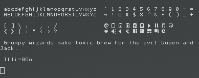

#mushi (Initialy uushi)

>My take on Monaco. Overall, it's much less curved than lemon but still retains many of the same features and ideas (e.g, readability, icons, etc).

Since tweaked into mono-spaced font, and further tweaked to make characters harder to confuse.

#Lemon (No Changes From Original)

Personal mod of lime with better kerning, more distinguished characters, and powerline/icon support.

#Note on icons/powerline

To enable powerline support, be sure to set powerline symbols to 'fancy'. To use the icons, enter vim's insert mode and hold ctrl-shift; while doing so, press the corresponding number of the desired icon (shown below). For convenience, both fonts use the same Unicode position for the same characters.

